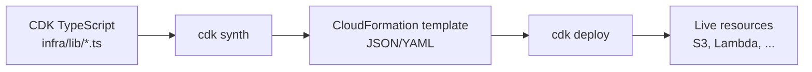

# CDK → CloudFormation walkthrough (PortfolioDemosStack)

This document maps **what you type in TypeScript** to **what AWS actually runs**, so deploys feel predictable instead of magical.

## Mental model



1. **CDK** is a compiler: constructs in code become a CloudFormation template.
2. **CloudFormation** is the deployment engine: it creates resources in order, rolls back on failure, and stores stack state.
3. **A stack** (`PortfolioDemosStack`) is one unit of create/update/delete.

## Commands you will use

| Command | What it does |
|---------|----------------|
| `cdk bootstrap` | One-time per account/region: S3 bucket + IAM for CDK asset uploads |
| `npm run build` | Compiles TypeScript → JavaScript for the CDK app |
| `cdk synth` | Prints the CloudFormation template (no AWS changes) |
| `cdk diff` | Shows resource-level changes vs what is already deployed |
| `cdk deploy` | Uploads Lambda assets, applies the template, waits for `CREATE_COMPLETE` |
| `cdk destroy` | Deletes stack resources (respects `RemovalPolicy`) |

Run these from `portfolio-aws-demos/infra/`.

## Resource-by-resource map

Open `infra/lib/portfolio-demos-stack.ts` beside `cdk.out/PortfolioDemosStack.template.json` after `cdk synth`.

| CDK construct | Typical CloudFormation type | Purpose |
|---------------|---------------------------|---------|
| `new s3.Bucket(...)` | `AWS::S3::Bucket` | Versioned bucket for generated docs |
| `new secretsmanager.Secret(...)` | `AWS::SecretsManager::Secret` | Config JSON (model id, bucket name) — **not API keys** |
| `new lambda.Function(...)` | `AWS::Lambda::Function` + `AWS::IAM::Role` | Python handler; IAM allows S3, Secrets, Bedrock |
| `new apigwv2.HttpApi(...)` | `AWS::ApiGatewayV2::Api` + routes + integration | `POST /generate` → Lambda |
| `new cdk.CfnOutput(...)` | `Outputs` section | Values printed after deploy (bucket name, API URL, secret ARN) |

### IAM (the glue)

Lambda gets an **execution role**. CDK helpers like `appSecret.grantRead(tableauDocFn)` add IAM policy statements to that role. In the template, look for `AWS::IAM::Policy` attached to the function role — that is how the function is allowed to call `secretsmanager:GetSecretValue` and `s3:PutObject` without hard-coded credentials.

### Bedrock permissions

```typescript
tableauDocFn.addToRolePolicy(
  new iam.PolicyStatement({
    actions: ["bedrock:InvokeModel", "bedrock:Converse"],
    resources: ["*"],
  })
);
```

This becomes an inline policy on the Lambda role. Your **AWS account user/role** still needs Bedrock model access in the console; IAM only allows the API call.

## Secrets: safe pattern

- **Never** commit `AWS_ACCESS_KEY_ID` or Bedrock keys to git.
- CDK creates a secret with a **placeholder JSON** (model id only). After deploy, run `aws secretsmanager put-secret-value` with `docs_bucket` filled from stack output `DocsBucketName`.
- Locally, export `PORTFOLIO_SECRET_ARN` and use the same secret via `portfolio_aws.load_config()`.

CloudFormation may show the initial placeholder in the template; rotate or overwrite via CLI if you prefer an empty secret at create time (advanced: custom resource or deploy-time parameter).

## Lambda asset packaging

`lambda.Code.fromAsset("../../lambdas")` zips the `lambdas/` folder at deploy time. The handler string `tableau_doc.handler.handler` means:

- Package root contains folder `tableau_doc/` with `handler.py`
- Function name is `handler`

`boto3` is included in the Lambda Python runtime; vendored `portfolio_aws` lives under `lambdas/shared/`. After editing `libs/portfolio_aws`, run `scripts/sync_portfolio_aws.sh`.

## CI/CD (GitHub Actions)

| Workflow | Trigger | Goal |
|----------|---------|------|
| `cdk-synth.yml` | PR + push to `main` | Validate TypeScript builds and template synthesizes |
| `cdk-deploy.yml` | Manual `workflow_dispatch` | Deploy to AWS via OIDC (no long-lived keys in GitHub) |

### OIDC setup (one-time, in AWS)

Run from a machine with AWS CLI + `gh` (repo admin):

```bash
./scripts/setup-github-oidc.sh
```

This creates the `token.actions.githubusercontent.com` OIDC provider, IAM role
`GitHubActionsPortfolioAwsDemosDeploy` (trust limited to `leducse/portfolio-aws-demos`),
attaches CDK-friendly policies, and sets GitHub secrets `AWS_ROLE_ARN` and `AWS_REGION`.

Deploy manually: **Actions → CDK Deploy → Run workflow**.

See [GitHub docs: configuring OpenID Connect in AWS](https://docs.github.com/en/actions/deployment/security-hardening-your-deployments/configuring-openid-connect-in-amazon-web-services).

## Debugging a failed deploy

1. **CloudFormation console** → stack `PortfolioDemosStack` → Events (which resource failed).
2. **Lambda** → Monitor → View logs in CloudWatch (runtime errors, Bedrock access denied).
3. **`cdk diff`** before redeploying to see drift.

## Tear down

```bash
cd infra && npx cdk destroy
```

`removalPolicy: DESTROY` on the demo bucket allows cleanup; production buckets would use `RETAIN`.

## Next stacks (roadmap)

| Stack | Services |
|-------|----------|
| `McpGovernanceStack` | EventBridge, Lambda, optional RDS |
| `MigrationAssistantStack` | Step Functions, S3 staging for QuickSight packages |

Keep each stack small so `cdk diff` stays readable and you learn one service group at a time.
